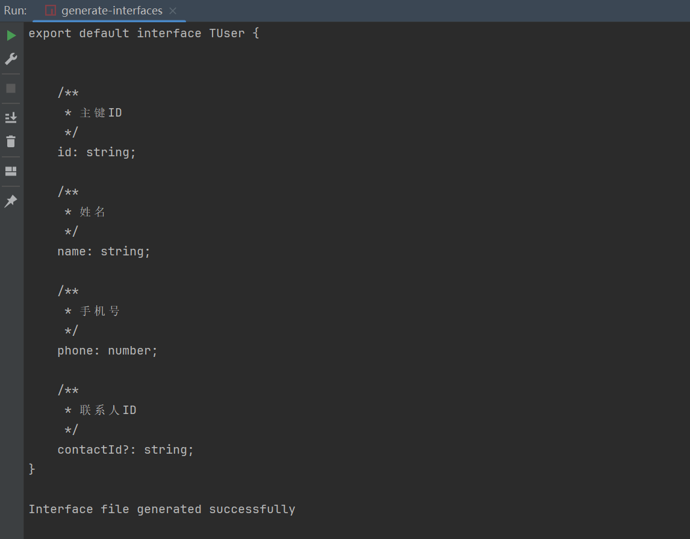
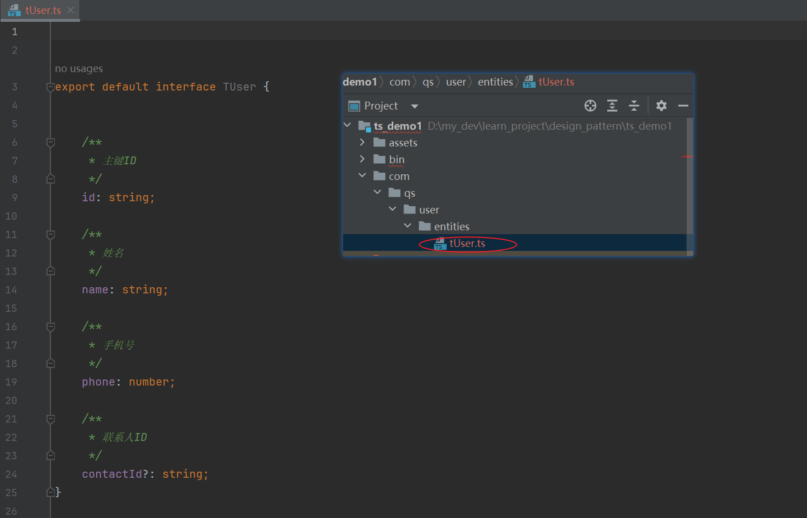

 # TS代码生成工具
 目前只支持PostgreSQL生成interfaces文件
 ## 1.使用说明  
 - 修改配置文件
    在项目根目录下有一个generator.yaml文件,修改为要生成的数据库信息
 - 执行package.json中的 generate-interfaces 脚本


## 2.使用示例
**示例表** 用户表： t_user

| 字段       | 类型           | 注释     | 是否非空 |
| ---------- | -------------- | -------- | -------- |
| id         | varchar（32）  | 主键ID   | 是       |
| name       | varchar（100） | 姓名     | 是       |
| phone      | int(11)        | 手机号   | 是       |
| contact_id | varchar (32)   | 联系人ID | 否       |


**生成interface**

```ts
/**
* 用户表
*/
export default interface TUser {
    /**
     * 主键id
     */
    id: string;
    /**
     * 姓名
     */
    name: string;
     /**
     * 手机号
     */
    phone: number;
     /**
     * 联系人ID
     */
    contactId?: string;
    }
```
## 3.资产文件
### 1.建表脚本
```sql
CREATE TABLE IF NOT EXISTS t_user (
                                      id VARCHAR(32) PRIMARY KEY,
    name VARCHAR(100) NOT NULL,
    phone INT NOT NULL,
    contact_id VARCHAR(32)
    );

COMMENT ON TABLE t_user IS '用户表';
COMMENT ON COLUMN t_user.id IS '主键ID';
COMMENT ON COLUMN t_user.name IS '姓名';
COMMENT ON COLUMN t_user.phone IS '手机号';
COMMENT ON COLUMN t_user.contact_id IS '联系人ID';

```
### 2.执行生成过程
#### 1.修改配置文件

#### 2.执行script generate-interfaces







### 3.生成文件

```ts


/**
 * 用户表
 */
export default interface TUser {


    /**
     * 主键ID
     */
    id: string;

    /**
     * 姓名
     */
    name: string;

    /**
     * 手机号
     */
    phone: number;

    /**
     * 联系人ID
     */
    contactId?: string;
}


```


参考项目：
- schemats
  [schemats]:https://www.npmjs.com/package/@tgriesser/schemats

